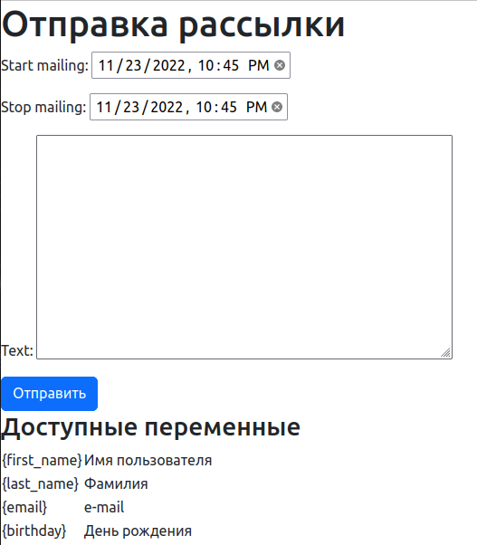

# Send_mailing_service

## Установка
```bash
python3 -m venv venv
. venv/bin/activate
cd send_mailing_service
pip install -r requirements.txt
```
Переименуйте файл ".env.exsample" в ".env" и введите необходимые данные.

## Запуск

* Выполните миграции # ```python manage.py makemigrations```
* Примените миграции # ```python manage.py migrate```
* Создайте суперпользователя # ```python manage.py createsuperuser```
* Запустите worker celery # ```celery worker --app=mailing --loglevel=info```

Выполните команду, для старта проекта и запуска локального сервера
```python manage.py runserver```

## Использование
* http://127.0.0.1:8000/admin # адрес для входа в админ панель
* http://127.0.0.1:8000/send/ # страница отправки рассылок
* http://127.0.0.1:8000/mailing-sender/open-tracking/ # отслеживание открытия писем


* Запуск сервиса с помощью **docker-compose**.
Выполните команду `docker-compose up --build`
или `docker compose up --build`
